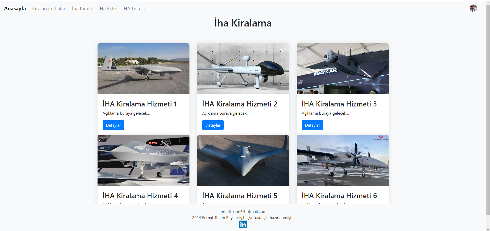
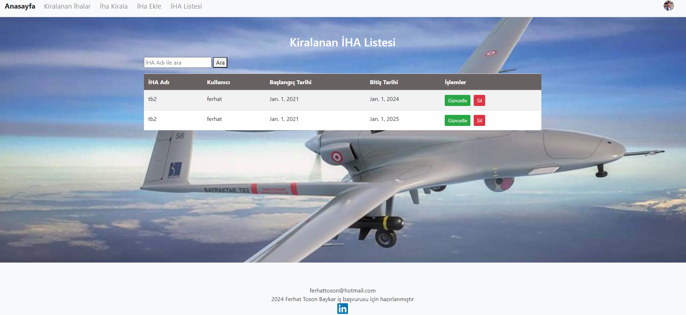
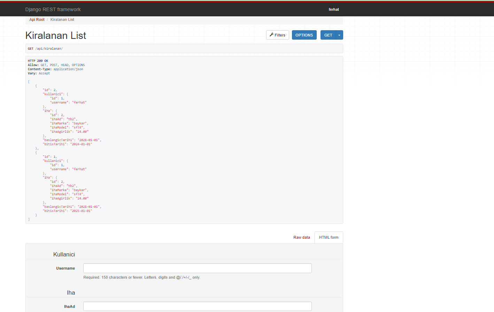
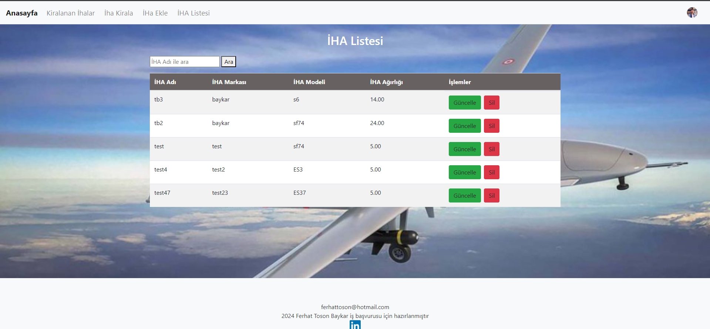
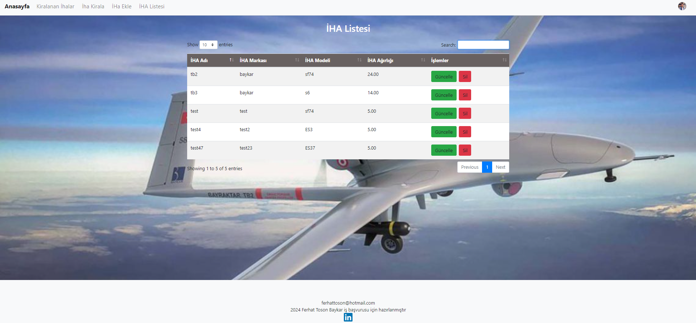
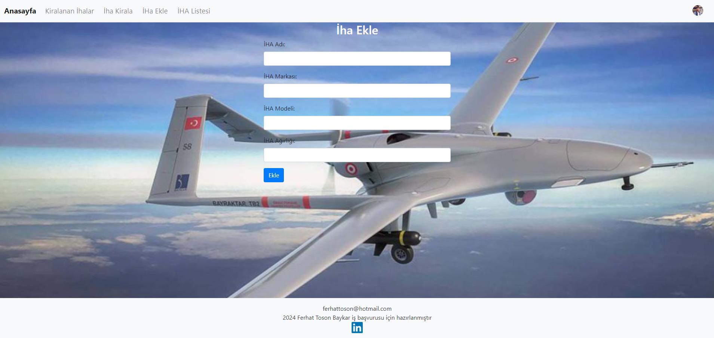
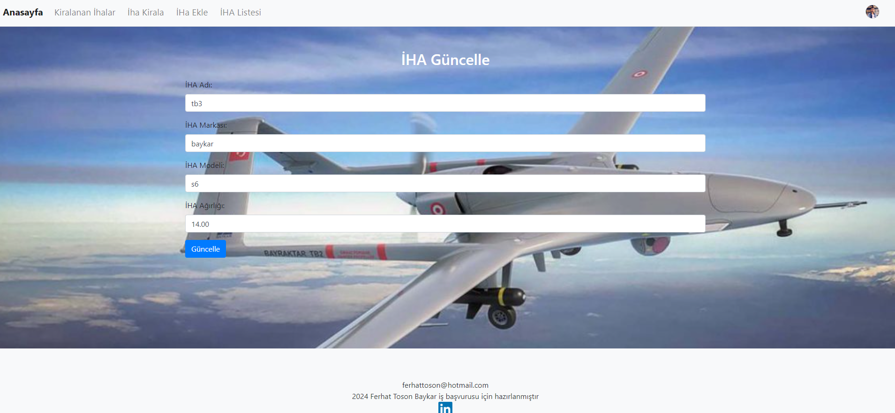
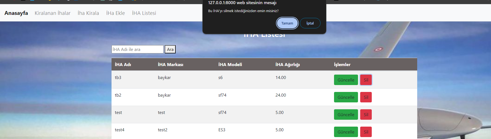

# :airplane: IhaKiralama

Bu proje, İnsansız Hava Araçları (İHA) kiralama işlemlerini yönetmek için bir web uygulamasıdır. Bu uygulama, kullanıcıların İHA kiralama işlemlerini kaydetmelerine, güncellemelerine ve silmelerine olanak tanır.
projede kullanılan teknolojiler arasında Django Framework, PostgreSQL veritabanı, Django Rest Framework (DRF) gibi güçlü araçlar yer alıyor. Kullanıcı arayüzü tasarımında Bootstrap ve jQuery gibi önemli kütüphaneler kullanılmıştır.

# :hammer_and_wrench: Kullanılan Kütüphaneler.

Projede kullanılan kütüphaneler aşağıda belirtilmiştir.

"shell
Django
Datatable
auth
djangorestframework
jsonschema
"

# :desktop_computer: İHA Kiralama Web Uygulaması

İHA Kiralama Web Uygulaması, kullanıcıların İnsansız Hava Araçları (İHA) kiralama işlemlerini yönetmelerine olanak tanıyan kullanıcı dostu bir çevrimiçi platformdur. Bu uygulama, İHA'ları kiralayanlar ve kiraya verenler arasındaki iletişimi ve iş süreçlerini kolaylaştırmayı hedefler.

# :books: Özellikler:

- Kullanıcı dostu arayüzü sayesinde İHA kiralama işlemlerini kolayca yönetin.
- İHA'ları sisteme ekleyin, güncelleyin veya silebilirsiniz.
- Kiralama işlemlerini takip edin ve kiralanmış İHA'ları listeleme özelliği ile kolayca erişim sağlayın.
- Güvenli kullanıcı kimlik doğrulama sistemi ile hesaplarınızı koruyun.
- Modern ve kullanıcı odaklı tasarımı sayesinde kolayca kullanın ve gezinin.

# :camera: Ekran Görüntüleri

### Giriş Ekranı

Kullanıcıların uygulamaya giriş yapmasını sağlayan sayfadır. Kullanıcı sisteme kayıtlıysa giriş yapabilir, kayıtlı değilse bu ekrandan kayıt ol sayfasına geçebilir. Projede, güvenli kimlik doğrulama ve oturum yönetimi işlevselliğini sağlamak için Django'nun kendi modülleri olan django.contrib.auth ve django.contrib.sessions kütüphanelerini kullandım.

django.contrib.auth: Django'nun sağladığı yerleşik kimlik doğrulama sistemi olan bu kütüphane, kullanıcıların güvenli bir şekilde giriş yapmasını, parola sıfırlama, parola değiştirme ve kullanıcı hesabı yönetimi gibi işlemleri kolayca gerçekleştirmesini sağlar.
django.contrib.sessions: Django'nun oturum yönetimi kütüphanesi olan bu modül, kullanıcıların oturumlarını yönetir ve oturum bilgilerini güvenli bir şekilde saklar. Bu sayede, kullanıcılar oturumları boyunca kimlik doğrulaması yapabilir ve uygulamanın farklı sayfaları arasında bilgileri paylaşabilirler

### Hesap Oluştur

Kullanıcıların uygulamaya kayıt olmasını sağlayan sayfadır. Kullanıcı "kullanıcı adı", "email", "şifre" bilgilerini doldurduktan sonra sisteme kayıt edilir. Kayıt olan kullanıcı bu sayfadan tekrar "Giriş Ekranı" sayfasına geçebilir.

### Ana Sayfa

Giriş yaptıktan sonra kullanıcıyı karşılaşayan sayfadır. Bu ekranda mevcut İHA kiralama hizmetleri listelenir.

### Kiralanan İHA Listesi

Kullanıcının kiraladığı İHA'lar bu ekranda gösterilir. 

Kullanıcın kiraladığı İHA'lar aşağıdaki API ile ekrana getirilir.

### İHA KİRALA

kullanıcı bu ekranda dropdown ile iha seçerek takvimden başlangıç ve bitiş tarihlerini belirleyerek yeni iha kiralar.

### İHA Listesi

Kiralanabilir İHA'lar bu ekranda listelenir.

Datatable uygulanmış tablo aşağıdaki gibidir.

Kullanıcın eklediği İHA'lar aşağıdaki API ile ekrana getirilir.

### İHA Ekle

Bu ekranda İHA eklemesi yapılır. İHA Adı, İHA Markası, İHA Modeli ve İHA Ağırlığı bilgileri kullanılarak veritabanına yeni İHA kaydedilir.

### İHA Güncelle

Veritabanında mevcut bir İHA'nin bilgileri güncellenmek istendiğinde bu ekranda yapılır. 

### İHA Silme

Veritabanında mevcut bir İHA silinmek istediğinde bu ekranda yapılır. Kullanıcının hata yapmasını önlemek için "Sil" butonuna tıklandıktan sonra bir uyarı mesajı verilerek kullanıcı uyarılır.

### Database:

